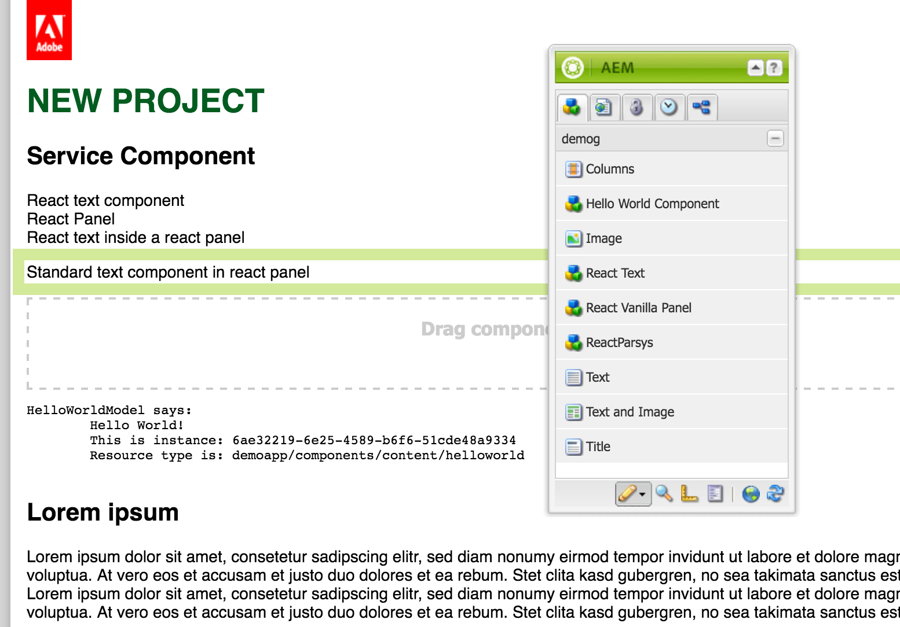
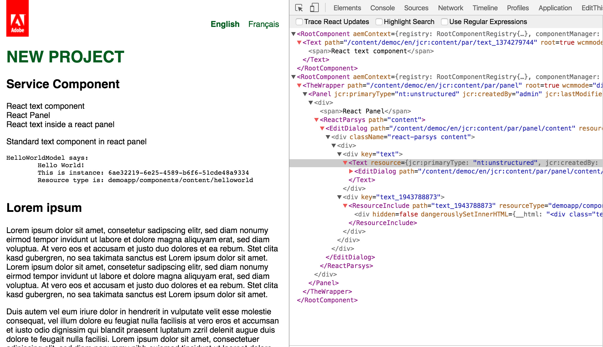

To quickly get started we will use the maven archetype.

# 1. create maven project

 ````bash
 mvn archetype:generate \
  -DarchetypeGroupId=com.sinnerschrader.aem.react \
  -DarchetypeArtifactId=aem-project-archetype \
  -DarchetypeVersion=10.x \
 ````
 
 > [[info]] __Versions__
 >
 > Get the latest [archetypeVersion](https://github.com/sinnerschrader/aem-project-archetype/releases). After generation of the project make sure that you also have
 > the latest versions of the [aem-react-js npm module](https://github.com/sinnerschrader/aem-react-js/releases) in `ui.apps/src/main/ts/package.json` and the latest [aem-react osgi bundle](https://github.com/sinnerschrader/aem-react/releases) in `core/pom.xml`.

 You will then be asked a couple of questions about project name and folder names and so on.
 These are the same as in the original archetype. Please find detailed
 explanations [here](https://docs.adobe.com/docs/en/aem/6-0/develop/dev-tools/ht-projects-maven.html) in the section "Getting started in
 5 minutes".

__Available properties__

 groupId            | Maven GroupId
 -------------------|------------------------------
 groupId            | Base Maven groupId
 artifactId         | Base Maven ArtifactId
 version            | Version
 package            | Java Source Package
 appsFolderName     | /apps folder name
 artifactName       | Maven Project Name
 componentGroupName | AEM component group name
 contentFolderName  | /content folder name
 cssId              | prefix used in generated css
 packageGroup       | Content Package Group name
 siteName           | AEM site name


# 2. start AEM

 AEM should now be running.


# 3. install demo

 ````bash
 mvn install -PautoInstallPackage
 ````

If your AEM instance is not running on localhost:4503 then you need to add additonal parameter

parameter | default
---|---
-Daem.port | 4502
-Daem.host | localhost


# 4. Open browser

To check what was deployed we will use the Classic UI.

- go to the page /content/${siteName}/en.html
- find react components in sidekick: _React Panel_, _React Text_ and _ReactParsys_
- find components already on the page



# 5. disable author mode

To check that we have actual react components in the page we will use the Classic UI.


- Disabled the author mode by appending `?wcmmode=disabled` to the url.
- Install your [react dev tool](https://chrome.google.com/webstore/detail/react-developer-tools/fmkadmapgofadopljbjfkapdkoienihi) in
chrome browser.
- Have a look at react component tree.



There are two _RootComponents_ which means two independent react component trees.
The first contains the _Text_ component.
The second contains the _Panel_ which is a vanilla react component and therefore wrapped by a _TheWrapper_ component.
The Panel's child is a _ReactParsys_ which contains another _Text_ component and a non-react component which inserted by the
_ResourceInclude_ component.
