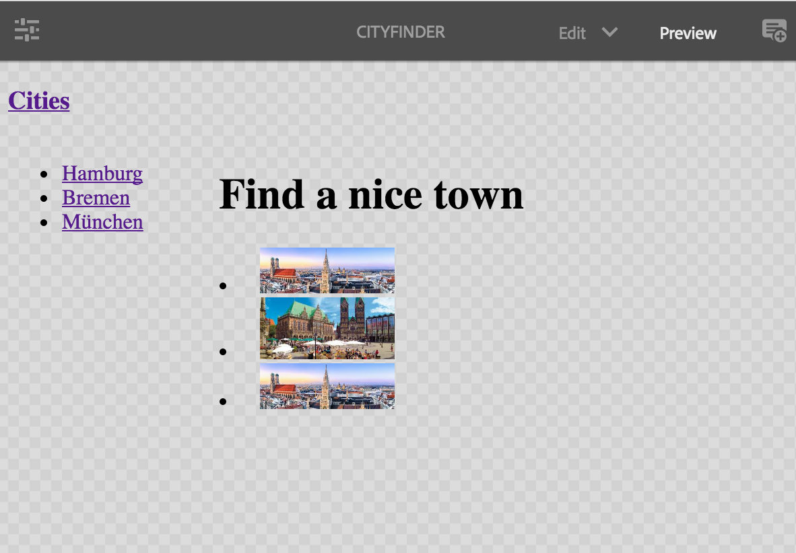
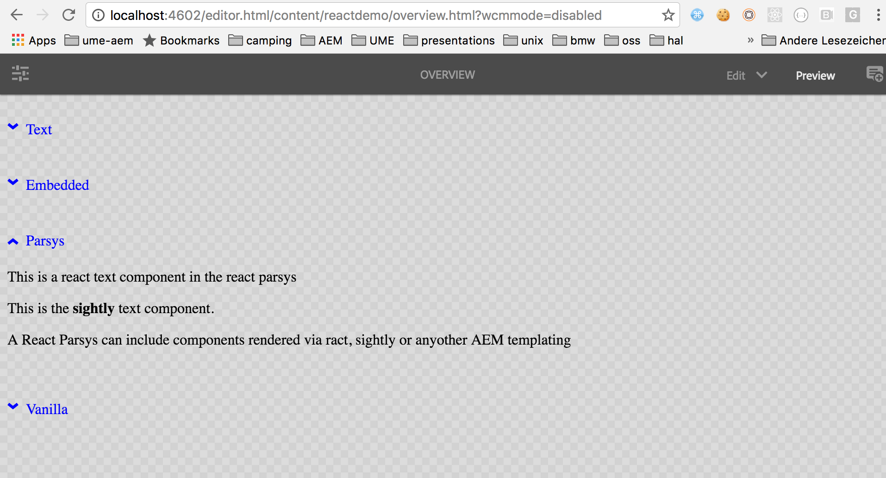

The aem-react project contains a demo content package.

# To run the demo

1. Clone git repo

  ````bash
  git clone https://github.com/sinnerschrader/aem-react.git
  ````

2. Install into running AEM

  ````bash
  mvn install -PautoInstallPackage -Daem.port=<port> -Daem.host=<host>
  ````

> [[warning]]
> Currently it is not possible to run the demo and the archetype in the same
> AEM. You need to adjust the path to the javascript in the react script engine via the webconsole.

# SPA with a two level page hierachy

Local url: [/content/reactdemo/cities.html](localhost:4502/editor.html/content/reactdemo/cities.html)


The SPA (single page application) is based on the [react router library](https://github.com/ReactTraining/react-router).
The SPA has a welcome view (/cities.html) and a detail view for each
city (e.g.: /cities/hamburg.html).




The main AEM react component is `CityFinder`.
A city can be selected from the list on the left.
This list is part of the `CityListView` react component which is displayed on all views.
Its child component is either `Home` for the welcome view or `CityView` for the detail view.
In the author mode each view is a single AEM page. Each page contains the CityFinder
 component which contains the router. `Home` and `CityListView` are plain react components while CityFinder and CityView are AEM react
 components.

A simplified version of `CityFinder` looks like this:
````jsx
export default class CityFinder {
  renderBody() {
    return (

      <Router history={history}>
         <Route path="cities.html" component={CityListView}>
             <IndexRoute component={Home} baseResourcePath={resourcePath}/>
             <Route path="cities/(:name).html" resourceComponent={CityView} component={ResourceRoute}/>
         </Route>
      </Router>

    );
   }
}

 ````

 The purpose of the generic `ResourceRoute` component is to translate the current
 routes dynamic path into a resource path which is passed to `CityView`.


# Component list

 Local url: [/content/reactdemo/overview.html](localhost:4502/editor.html/content/reactdemo/overview.html)

 The list of components  include:

 - simple text component
 - embedded component
 - accordion component which shows client-side interactivity and serves as a container.
 - vanilla component
 - vanilla panel which serves as a container

