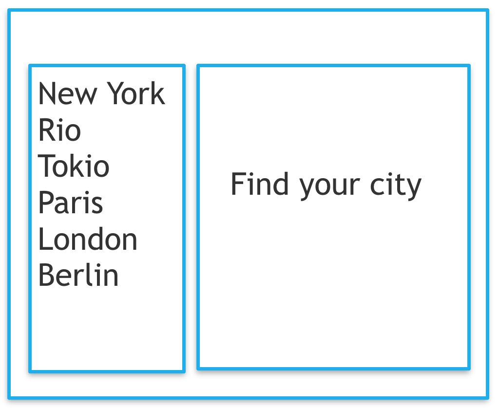
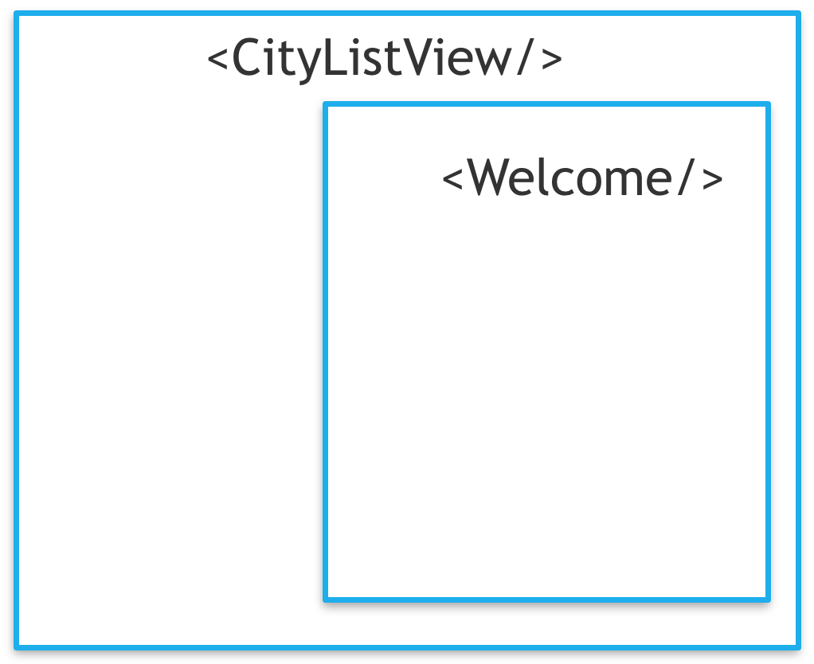
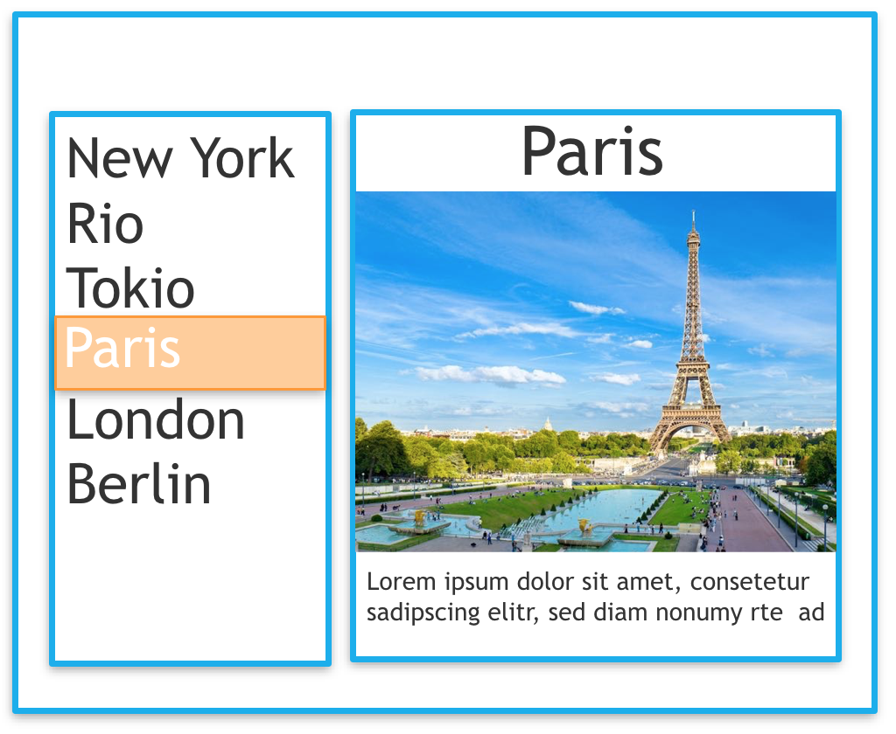
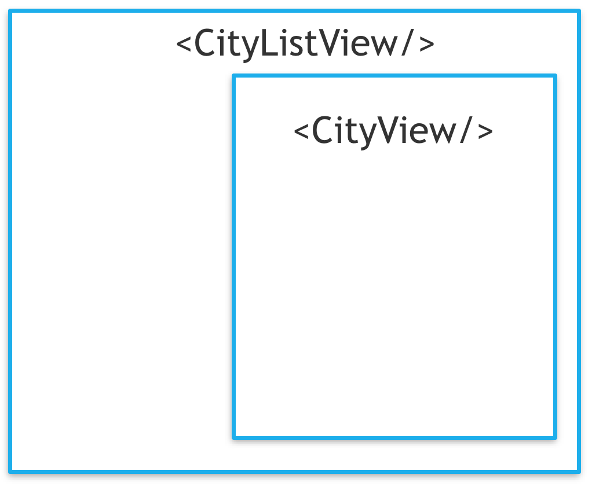

Usually a single react component contains the router configuration. In this configuration
all views and their urls are configured. These urls may contain dynamic parts, which are sometimes
made available to the components comprising the views.

The example application consists of two views.

## Welcome view

The welcome view presents a list of cities on the left and a welcome message on the right.



The `welcome` component tree consists of the `CityListView` and the `Welcome` component




## City view

The `city` view presents a list of cities on the left and a welcome message on the right.



The welcome component tree consists of the `CityListView` and the `CityView`.




## Router

There are two routes in this example:

1. The route to the welcome view is static: `/cities/index.html`
2. The second route points to the individual city views and is dynamic: `/cities/(:name).html` 

Another aspect of the route definition is how it affects the component tree. The `CityListView` is present
in all routes while its child depends on the individual route. The router configuration looks like this:

````jsx
<Router history={history}>
    <Route path='/cities.html' component={CityListView}>
        <IndexRoute component={Welcome}/>
        <Route path='/cities/(:name).html' resourceComponent={CityView} component={ResourceRoute}/>
    </Route>
</Router>

```` 

Note that the component of the city view is not the `CityView` component but a general `ResourceRoute` component. Its purpose
is to translate the path to a resourcePath and pass it to the component defined by the `resourceComponent` property.

To use this component you create AEM pages resemble the router configuration. 

- /cities.html
    - /cities/hamburg.html
    - /cities/münchen.html
    
> # Important [[info]]
>The router component must be located in the same path relative to the page.
>
>